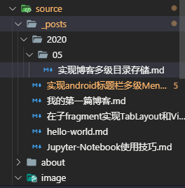
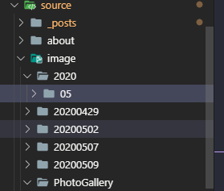

    实现将hexo中的markdown文件按照日期分成不同的文件夹。
<!-- more -->

### 1:问题描述

​    原来使用hexo的命令创建博客文件时，所有的markdown文件全部放在了source/_posts的目录下，现在想实现将新创建的markdown文件按照文件创建的日期自动归档这样的话，可以使得自己的博客文章归档的目录一目了然。


### 2:实现的步骤

实现的步骤如下所示：

​	 生成的文章名字及其对应永久链接，可以在`_config.yml`中配置，分别是`new_post_name: :title.md # File name of new posts`和`permalink: :year/:month/:day/:title/`这两项。  把`new_post_name`的值改为`:year/:title.md` ， 让每次运行`hexo new post [title]`时新建的文件按年份存放，  但是却发现生成的html文件的链接也变了，比如`source/_post/2018/test.md`对应的博客地址，  原本应该是`2018/12/22/test/`，现在却变成了`2018/12/22/2018/test/`。  也就是，配置中的`permalink`值里的`:title`，实际取的不是**文件名称**，而是相对于`source/_post`的**相对路径**（不含后缀）。  这可能是个Bug，因为在`permalink`和`new_post_name`中，用的是同一个变量`:title`，但是它们的值却是不同的。 

### 

 如果我们是按年月日归档，而链接保持不变，大可配置为如下： 

```
permalink: :title
new_post_name: :year/:month/:day/:title/
```

如果想按年月归档，可以这样设置：

```
new_post_name: :year/:month/:title.md
```

而文章的链接，一番搜索之后，发现可以在我们文章的markdown文件的Front-matter中添加permalink参数，来指定文章的链接（见 https://hexo.io/docs/permalinks.html#comment-2657776966 ）。如果我们在_config.yml中的permalink配置为如下：

```
permalink: :year/:month/:day/:title/
```

 那最终生成的文章的链接就是`:year/:month/:day/:文章中的permalink/`。这完全就是我想要的！ 


### 3:markdown的模板设置

 文章的模版在`scaffolds/post.md`，内容修改如下： 

```
---
title: {{ title }}
permalink: {{ title }}
date: {{ date }}
tags:
categories:
---
```


### 4:本地图片插入格式

这样设置完之后，我的本地图片也想按照这样展示，按日期进行归档，但是在进行相对路径填写时，需要有点改变

我的本地所有图片的存放位置在跟_posts文件夹同级的目录下的image文件夹下，如下图所示:


此时图片的相对路径是图片相对于markdown文件的路径，所以需要设置为：

```

```


### 5:参考文章

  https://blog.csdn.net/maosidiaoxian/article/details/85220394 


### 6:补充文章

当hexo博客迁移时可以参考这个

 https://blog.csdn.net/xjm850552586/article/details/84101308 

